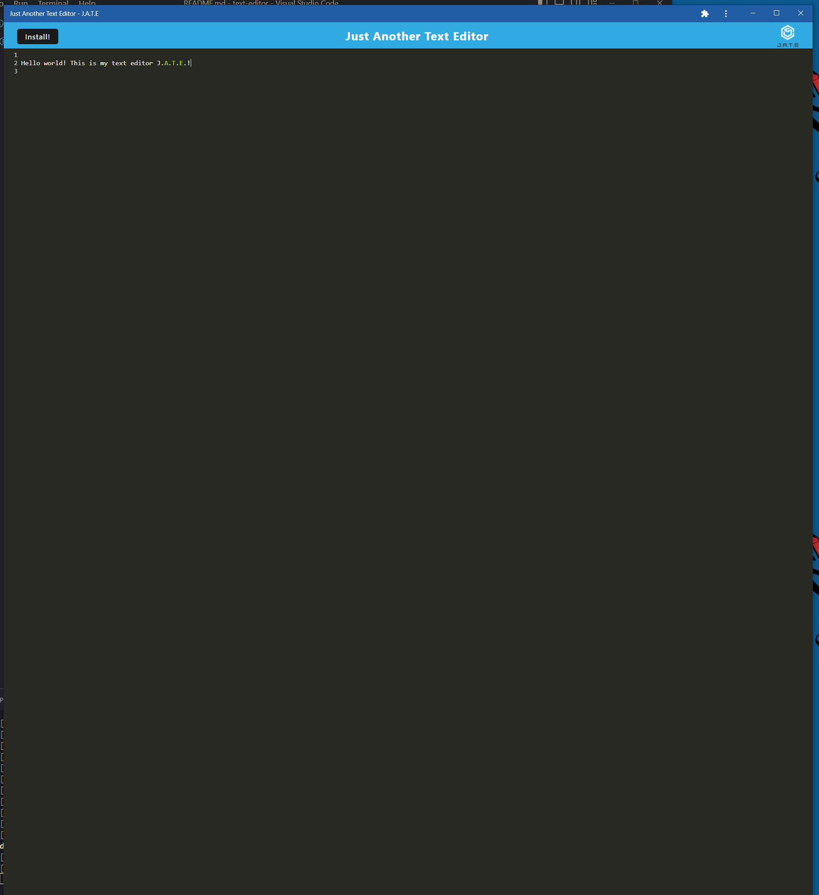
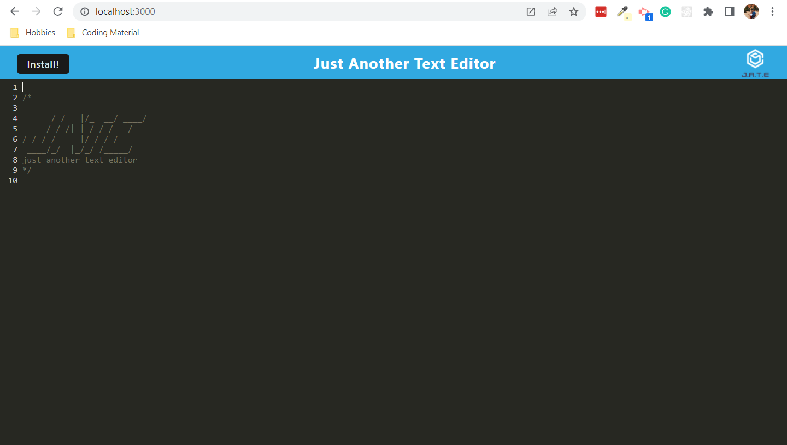

# Text Editor

## Description

This project is a text editor that runs in the browser. The app is a single-page application that meets the PWA criteria.

Depolyment link: 

## Installation

Clone the repo and run an 'npm i' to install dependencies. Run npm start to launch. The app will be avaliable locally at http://localhost:3000/.

If loading via Heroku, click the downloadable app button in the browser bar to install.

## Screenshots

---
---

## Usage

Feel free to use the app however you please once it is launched.

## Credits

- Columbia Coding Bootcamp

## License

MIT License
